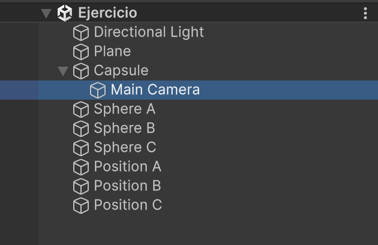

# IA Básica Matemáticas

## Descripción

He creado una nueva escena `Ejercicio` con una GameObject `Capsule`, que es el objeto que controla el jugador y tres GameObject `Sphere`, que son los objetos que siguen al jugador.

## Jugador

Utiliza la clase `VillagerDrive` para sus movimientos.

Se le ha añadido la `Main Camera` al GameObject, así cuando el jugador mueve el objeto, le va siguiendo la cámara.



Lo único que se ha modificado en este script son los parámetros `public` por `SerializeField`.

## Esferas (Sphere)

Utiliza la clase `PigMove` como referencia.

A la posición inicial de cada esfera se ha añadido un `Empty Object` para indicar su posición inicial. El script obtiene el Game Object desde el Inspector.

```csharp
[SerializeField] GameObject startingPosition;
```

Se ha puesto un limitador de detección.

```csharp
// Si el objeto del jugador está a mas de 1f y menos de 8f unidades
if (direction.magnitude > 1 && direction.magnitude < 8f)
{
    Search(direction);
}
// Si el objeto del jugador está a mas o igual de 8f unidades
else if (direction.magnitude >= 8f)
{
    Search(startingPosition.transform.position - this.transform.position);
}
```

- **Si el jugador está a mas de 1f y menos de 8f:** Las esferas siguen al jugador y se detienen cuando están a menos de 1f.
- **Si el jugador está a mas de 8f unidades:** Las esferas vuelven al punto de partida.

Para refactorizar el script, he creado el siguiente método:

```csharp
void Search(Vector3 dir)
{
    Vector3 velocity = dir.normalized * speed * Time.deltaTime;
    this.transform.position = this.transform.position + velocity;
}
```

Este método tiene como parámetro la dirección que debe seguir cada esfera.